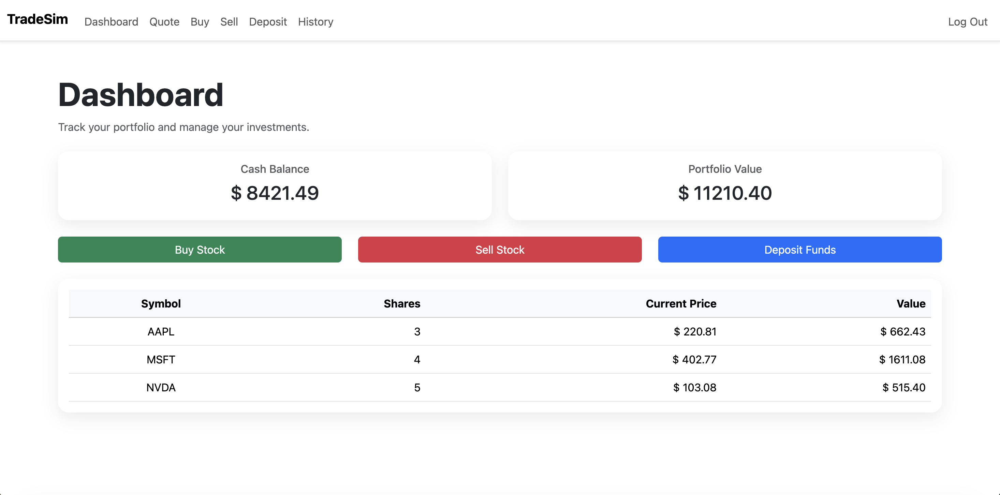

# TradeSim



TradeSim is a stock trading simulator built with Flask, SQLite and Bootstrap.

Users can create an account, search stock prices, buy and sell shares, deposit funds, and track their portfolio performance through a dashboard.

## Features

* User registration and authentication
* Stock quote lookup
* Buy shares
* Sell shares
* Cash deposits
* Portfolio dashboard
* Transaction history
* Password hashing for secure authentication

## Technologies

* Python
* Flask
* SQLite
* Bootstrap 5
* Jinja2
* CS50 SQL Library

## Installation

Clone the repository:

```bash
git clone https://github.com/mwehrmann/TradeSim.git
cd TradeSim
```

Install dependencies:

```bash
pip install -r requirements.txt
```

Set a secret key:

```bash
export SECRET_KEY="your-secret-key"
```

Create the database:

```bash
sqlite3 finance.db < schema.sql
```

Run the application:

```bash
flask run
```

Open your browser and visit:

```text
http://127.0.0.1:5000
```

## Database Schema

### users

Stores user accounts and available cash balances.

### trades

Stores all transactions including:

* Buy orders
* Sell orders
* Deposits

## Future Improvements

* Unified trade page for buy and sell orders
* Withdrawal functionality
* Portfolio performance charts
* Search and filtering for transaction history
* Improved mobile responsiveness

## License

This project was created for educational purposes and portfolio demonstration.
